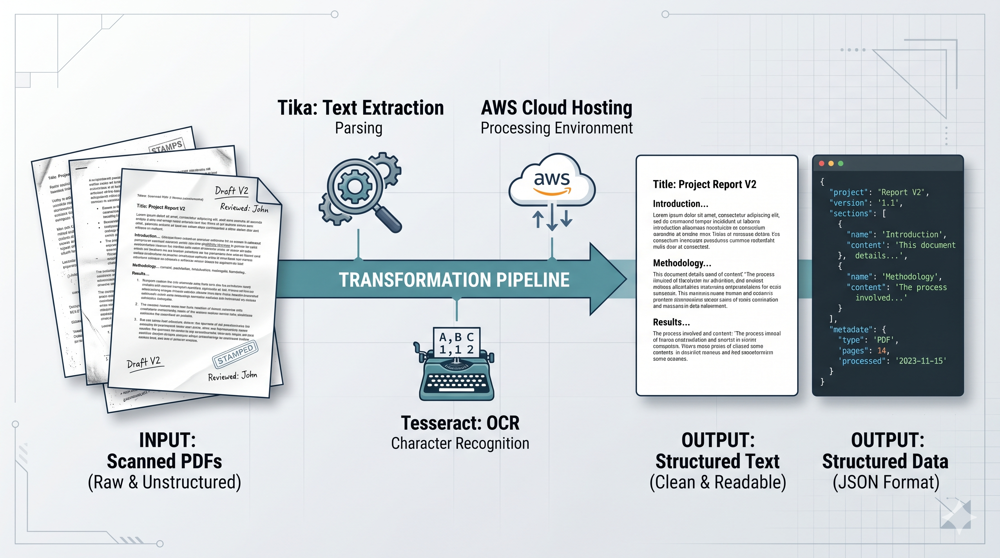

<h1 align="center">pdf2readable</h1>

<p align="center">
  <em>OCR microservice that turns scanned PDFs and images into searchable, machine-readable text — Apache Tika + Tesseract + Celery + AWS, packaged as a serverless-friendly Flask service.</em>
</p>

<p align="center">
  
  
  
  
  
  
  
  
</p>

<!--
TODO: Drop a hero image at docs/hero.png — easiest version is a side-by-side
of a scanned PDF page on the left and the extracted JSON / text on the right.
-->
<p align="center">
  
</p>

---

## Overview

A small, opinionated OCR service that takes a PDF or image and returns extracted text. Most documents are routed through **Apache Tika** for fast extraction; scanned pages (or anything where Tika returns empty / mostly empty text) fall back to **Tesseract OCR**. Jobs are queued in **Celery** so the HTTP API stays responsive, and finished output is written to **AWS S3** for retrieval.

Two ways to deploy it:

- **Docker / docker-compose** — single host, classic queue worker setup
- **Serverless** — Flask app behind API Gateway, S3 + SQS for the async pipeline

## Highlights

- ⚡ **Dual-path extraction** — Tika first (fast, structured), Tesseract second (only when needed)
- 🌍 **Multi-language OCR** — Tesseract language packs configurable per request
- 🔁 **Async by default** — POST submits a job; client polls or reads from S3 webhook
- ☁️ **AWS-native** — S3 for in/out, optional SQS as the Celery broker, IAM-role friendly
- 🧰 **Docker images for every component** — Tika, Tesseract workers, Flask API, Redis (default broker)

## API

| Method | Path | Description |
|---|---|---|
| `GET`  | `/health`        | Liveness check |
| `POST` | `/jobs`          | Submit a file (multipart) or an S3 key → returns a job id |
| `GET`  | `/jobs/<id>`     | Poll job status (pending / running / done / failed) |
| `GET`  | `/jobs/<id>/text` | Fetch extracted text once the job is done |

OpenAPI docs are auto-rendered at `/docs` when running locally.

## Architecture

```
┌────────────┐   POST /jobs   ┌──────────┐   enqueue   ┌──────────┐
│   Client   │ ─────────────▶ │  Flask   │ ──────────▶ │   Redis  │
│            │ ◀───── job_id  │   API    │             │  (broker)│
└────────────┘                └──────────┘             └────┬─────┘
                                                            │
                                              ┌─────────────┴──────────────┐
                                              │       Celery workers       │
                                              │                            │
                                              │   ┌───────┐    ┌───────┐  │
                                              │   │ Tika  │ or │Tesser-│  │
                                              │   │ path  │    │ act   │  │
                                              │   └───────┘    └───────┘  │
                                              └─────────────┬──────────────┘
                                                            │
                                                            ▼
                                                      ┌──────────┐
                                                      │   S3     │
                                                      │ (output) │
                                                      └──────────┘
```

## Tech stack

- **Language:** Python 3.10+
- **API:** Flask + Flask-RESTful
- **Queue:** Celery with Redis (default) or SQS
- **Extraction:** Apache Tika (sidecar container), Tesseract OCR
- **Storage:** AWS S3 (input and output), local filesystem also supported for dev
- **Deployment:** Docker / docker-compose for self-hosted; Serverless framework manifests included

## Project structure

```
.
├── app/
│   ├── api/                # Flask routes
│   ├── tasks/              # Celery task definitions
│   ├── extractors/
│   │   ├── tika.py         # Tika HTTP client
│   │   └── tesseract.py    # Local Tesseract wrapper
│   ├── storage/
│   │   ├── s3.py
│   │   └── local.py
│   └── config.py
├── docker/
│   ├── Dockerfile.api
│   ├── Dockerfile.worker
│   └── docker-compose.yml
├── serverless/
│   └── serverless.yml      # API Gateway + Lambda config
├── tests/
└── README.md
```

## Getting started

### Prerequisites

- Docker + docker-compose **OR** Python 3.10+ and Tesseract installed locally
- An S3 bucket if you want cloud storage (optional in dev)

### Run locally with Docker (recommended)

```bash
git clone https://github.com/aifriend/pdf2readable.git
cd pdf2readable
cp .env.example .env   # fill in AWS creds + bucket name if using S3
docker-compose up --build
```

The API is now at `http://localhost:5000`.

### Submit a job

```bash
# Upload a local PDF
curl -X POST http://localhost:5000/jobs \
  -F file=@/path/to/scanned.pdf

# → {"job_id": "f3a8...", "status": "pending"}
```

### Poll for status

```bash
curl http://localhost:5000/jobs/f3a8...
# → {"status": "done", "text_url": "s3://your-bucket/out/f3a8.txt"}
```

### Fetch text

```bash
curl http://localhost:5000/jobs/f3a8.../text
```

### Run locally without Docker

```bash
brew install tesseract  # macOS; apt-get on Linux
pip install -r requirements.txt
celery -A app.tasks worker -l info &
python -m app
```

## Configuration

All via env vars:

| Variable | Default | Meaning |
|---|---|---|
| `S3_BUCKET` | (none) | S3 bucket for input/output |
| `CELERY_BROKER_URL` | `redis://redis:6379/0` | Celery broker |
| `TIKA_URL` | `http://tika:9998` | Tika server endpoint |
| `OCR_LANGUAGES` | `eng+spa` | Tesseract language pack(s) |
| `OCR_FALLBACK_THRESHOLD` | 50 | Trigger Tesseract when Tika returns fewer than N characters |

## Tests

```bash
pytest tests/
```

Includes unit tests for the extractor routing logic and integration tests that spin up Tika + Tesseract in containers.

## Deploy as serverless

```bash
cd serverless
serverless deploy --stage prod
```

This provisions API Gateway → Lambda for the Flask app, SQS as the queue, and uses S3 for both input and output. Workers run as separate Lambda functions triggered by SQS messages.

## Roadmap

- [ ] Layout-aware extraction (preserve tables, multi-column text)
- [ ] Pluggable post-OCR cleanup (regex rules, spell-correction)
- [ ] Web UI for drag-and-drop uploads + result preview
- [ ] Confidence scores per page and per word
- [ ] Replace Tika sidecar with a pure-Python fallback for cold-start sensitive deploys

## License

MIT — see [LICENSE](LICENSE).

## Author

**Jose Lopez** — AI engineer in Madrid, working on the intersection of biological and artificial intelligence.

- GitHub: [@aifriend](https://github.com/aifriend)
- LinkedIn: [jafdl](https://www.linkedin.com/in/jafdl)
- Website: [auto-latam.com](https://auto-latam.com/en)

## Acknowledgments

- [Apache Tika](https://tika.apache.org/) for the fast first-pass extraction
- [Tesseract OCR](https://github.com/tesseract-ocr/tesseract) for the heavy lifting on scans
- The Flask / Celery / Serverless communities for keeping each of those parts easy to wire together
